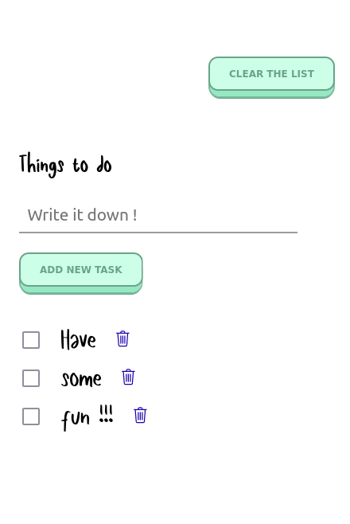

# Simple app with list of things to do.

## Table of contents

- [Overview](#overview)
  - [The challenge](#the-challenge)
  - [Screenshot](#screenshot)
  - [Links](#links)
- [My process](#my-process)
  - [Built with](#built-with)
- [Author](#author)

## Overview

### The challenge

Users should be able to :

- Add new task to the list
- Mark task as complete
- Delete task from the list
- Clear the list

### Screenshot

### Links

- Solution URL: [Add solution URL here](https://your-solution-url.com)
- Live Site URL: [Add live site URL here](https://your-live-site-url.com)

## My process

### Built with

- Semantic HTML5 markup
- CSS custom properties
- CSS modules
- Flexbox
- Mobile-first workflow
- [React](https://reactjs.org/) - JS library

### What I've learned

- How to use CSS modules
- Gain practice with organizing React components.

## Author

jolka_ef
